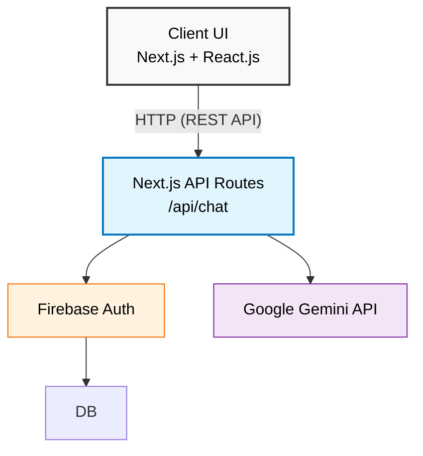

# Smart Ration Portal

A full-stack web application designed to improve transparency and accessibility in the Public Distribution System (PDS). The portal provides role-based access for Administrators, PDS Shopkeepers, and Citizens, enabling secure authentication, batch management, delivery tracking, and AI-powered assistance.

## Features

* Role-based authentication using Firebase Authentication
* Separate dashboards for Admin, Shopkeeper, and Citizen
* FIFO-based inventory and batch management
* Batch creation and tracking
* Delivery monitoring interface
* Gemini-powered AI chatbot for user assistance
* REST API integration using Next.js API Routes
* Responsive user interface built with Next.js
* Cloud deployment on Vercel with GitHub-based CI/CD
* Deployment analytics using Vercel Analytics

## Tech Stack

### Frontend

* Next.js
* React.js
* HTML5
* CSS3
* JavaScript (ES6+)

### Backend

* Next.js API Routes
* REST APIs

### Authentication & Database

* Firebase Authentication
* Cloud Firestore

### AI Integration

* Google Gemini API

### Deployment

* Vercel
* GitHub

## System Architecture

## Project Modules

### Module 1 – Landing Page & GitHub Deployment

* Designed a responsive landing page using HTML and CSS.
* Deployed the project using GitHub Pages.

### Module 2 – Next.js Setup

* Migrated the project to Next.js.
* Implemented routing and reusable page structure.

### Module 3 – Reusable Components

* Developed Batch Tracker component.
* Developed Delivery Monitor component.
* Managed component state using React Hooks.

### Module 4 – AI Chatbot Integration

* Built a Gemini-powered chatbot.
* Created REST API endpoints using Next.js API Routes.
* Integrated frontend with backend using HTTP POST requests.

### Module 5 – Authentication & Cloud Services

* Implemented Firebase Authentication.
* Stored user role information in Cloud Firestore.
* Integrated Vercel Analytics.
* Deployed the application on Vercel.

## Project Highlights

* Secure role-based authentication
* FIFO-based inventory and batch management
* RESTful API integration
* AI-powered chatbot
* Cloud-hosted backend services
* Responsive web application
* GitHub-based CI/CD
* Production deployment on Vercel

## Future Enhancements

* GPS-based ration vehicle tracking
* Inventory demand forecasting using AI
* OTP/Biometric verification for ration collection
* Advanced analytics dashboard
* Notification system for citizens
* Digital ration card integration

## Skills Demonstrated

* Full Stack Web Development
* React.js
* Next.js
* REST API Development
* Firebase Authentication
* Cloud Firestore
* State Management
* Git & GitHub
* CI/CD
* Cloud Deployment
* Vercel
* API Integration
* Responsive Web Design

## Resume Summary

**Developed a role-based Smart Ration Portal with secure authentication, FIFO-based inventory and batch management, delivery tracking, Gemini-powered chatbot support, RESTful API integration, and deployment on Vercel with GitHub-based CI/CD.**
